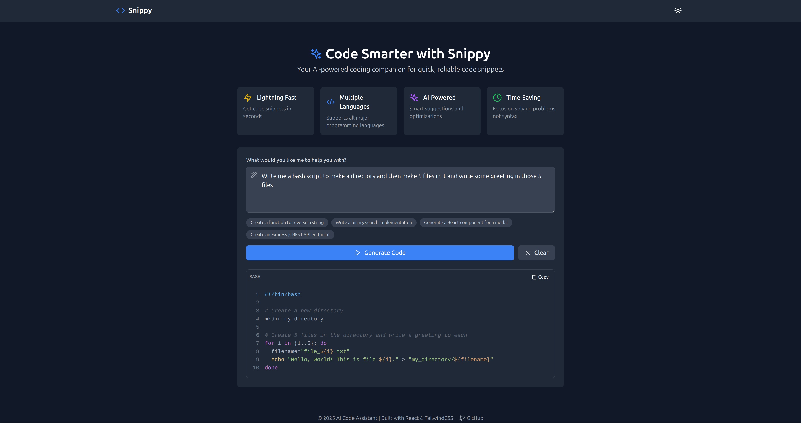

# Snippy - AI Code Snippet Generator 🚀



Snippy is a full-stack application that generates code snippets using AI. It combines a Python/Flask backend with a React frontend to provide an intuitive interface for developers to get instant code solutions.

## Features ✨

- **AI-Powered Code Generation** using Groq's API  
- **Multi-Language Support** (Python, JavaScript, Java, etc.)  
- **Copy-Paste Ready** output with syntax highlighting  
- **Dark/Light Mode** toggle  
- **Responsive Design** works on all devices  
- **Example Prompts** for quick testing  

## Tech Stack 💻

### Frontend
- React (Vite)  
- TypeScript  
- Tailwind CSS  
- ShadCN UI Components  
- Lucide Icons  

### Backend
- Python  
- Flask  
- Flask-CORS  
- Groq API  

### Deployment Options
- Vercel (Frontend + Serverless Functions)  
- Docker (Local/Production)  
- Render.com (Alternative)  

## Getting Started 🛠️

### Prerequisites
- Node.js (v18+)  
- Python (3.9+)  
- Groq API Key (free tier available)  

### Local Development

1. **Clone the repository**  
   ```bash
   git clone https://github.com/yourusername/Snippy.git
   cd Snippy)
   ```
2. **Set up backend**  
   ```bash
    cd api
    python -m venv venv
    source venv/bin/activate  # Linux/Mac
    # venv\Scripts\activate  # Windows
    pip install -r requirements.txt
    python app.py
   ```  
3. **Set up frontend**  
   ```bash
    cd ../frontend
    npm i
    npm run dev
   ```  
4. **Environment Variables**
   ```bash
   echo "GROQ_API_KEY=your_actual_key_here" > api/.env
   ```

## Connect with Me 👋

Let's connect and collaborate! Feel free to reach out for:
- Project collaborations
- Job opportunities
- Technical discussions
- Feedback about this project

[](https://www.linkedin.com/in/ishaangoel-craftyengineer/)
    
